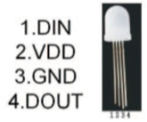

# APA106 leds

For the RGB leds, I choose some cheap 5mm WS2812 clones.
I bought 50 of them for 12€ on [chineese shop](https://fr.aliexpress.com/item/10pcs-1000pcs-DC5V-APA106-F5-5mm-F8-8mm-Round-RGB-LED-APA106-chipset-inside-RGB-Full/32792759587.html). They are not as good as the original ones (NeoPixels for example), but much more cheaper.

**Don't do like me, buy opaque LEDs, the render will be better.**

## use

They are easy to use. They are composed of 4 pins:

1. `Data In`: data that arrives from previous LED
2. `Vcc`: +5V 
3. `Gnd`: Ground
4. `Data Out`: data to send to the next LED

They receive data from `Data In` pin (at 400 or 800KHz), and propagate the next data arriving to Data Out pin. So to use several of them, we just need to chain them (each LED `Data Out` is linked to the `Data In` pin of the next LED in the chain).

The data sent is 3 octets, corresponding to the Red, Green and Blue values.

WARNING: for most of my LEDs( not all!), the Red and Green data are swaped. So I had to adjust manually this in my code (see `RGB.py` code).

## library

For the moment, we are using the [Light WS2812 library for ARV](https://github.com/cpldcpu/light_ws2812). This library proposes small code to communicate with WS2812 LEDs (it works perfectly with our APA106) using bit-banging.

NOTE: I choose to use the `USI Data Out` of the AVR to drive the LEDs, so that I can use `USI` hardware instead of just bit-banging (better to use hardware peripheric when they are available instead of using software to emulate them). But it requires more of my time than just includes the Light WS2812 library and uses it directly (this library works out of the box, just need to indicate the pin configuration). 

## Blinkning

I wanted