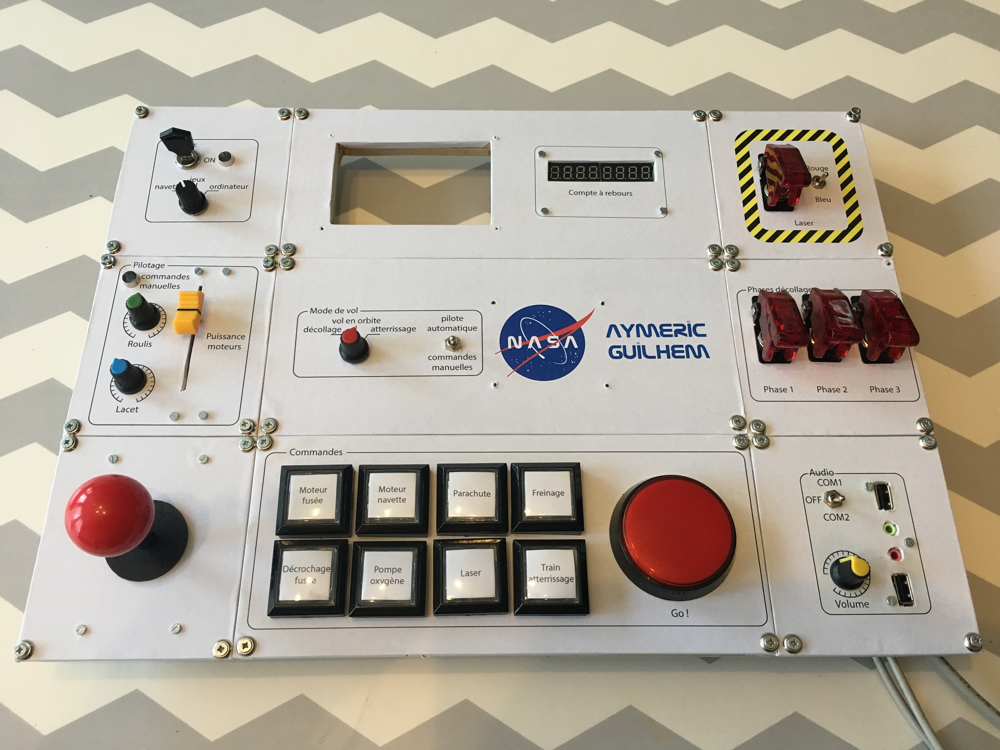

# What is *MissionBoard* ?

It's a simple DIY project I made for my kids: it consists in a wallet with a lot of buttons and some electronics (Raspberry Pi) to let them play and have fun playing and piloting a spaceship.

# How does it start ?

Have you seen [this](http://makezine.com/projects/mission-control-desk) project ?

For his kids, Jeff Highsmith has build a mission control desk. So amazing! If I was between 5 and 8 years old, I would want the same ! So, since my kids are now 6 and 3, I want to do for them something like that, something they can play with, they can project themselves into and imagine stories where they are piloting spaceships (or being at the Space Command Center, or even pretending being a secret spy that need to defuse a bomb...). **Anyway, I must build them something like that !!**

Something smaller. And not too expensive (let's say around 90€, including touch screen, a lot of boutons and displays, and a joystick to play some videogames).
And I want this to be easily transportable. And be able to serve as a game console (so with a screen, joystick and some push buttons). And that can be used as a fun computer if when they want to learn programming...

So this is the plan: I will design something that can fit in a case, and this github will collect all the data for this project. I will try to post pictures, scheme and code, so that anyone can do the same, learn from my experience and mistakes, and make a better mission control desk for its kids.

# Projet steps

- [x] [Decide the functionalities](functionalities.md)
- [x] [Choose the materials](bom.md)
- [x] Design the panels
- [x] Realize the panels
- [ ] Solder and connect everything
- [ ] Develop the software
- [ ] Enjoy with the kids !

# Few pictures of project in its current state

# Few words about the doc
I try to do my best to make a valuable documentation, specially if someone wants to make it owns (and adapt mine, reuse the code, etc.).
English is not my mother tongue, and sometimes, the words/sentences/expression I used are not correct.
If someone wants to contribute, do not hesitate to fork the project, improve my english, and submit a pull request for that. That would be greatly appreciated !!

