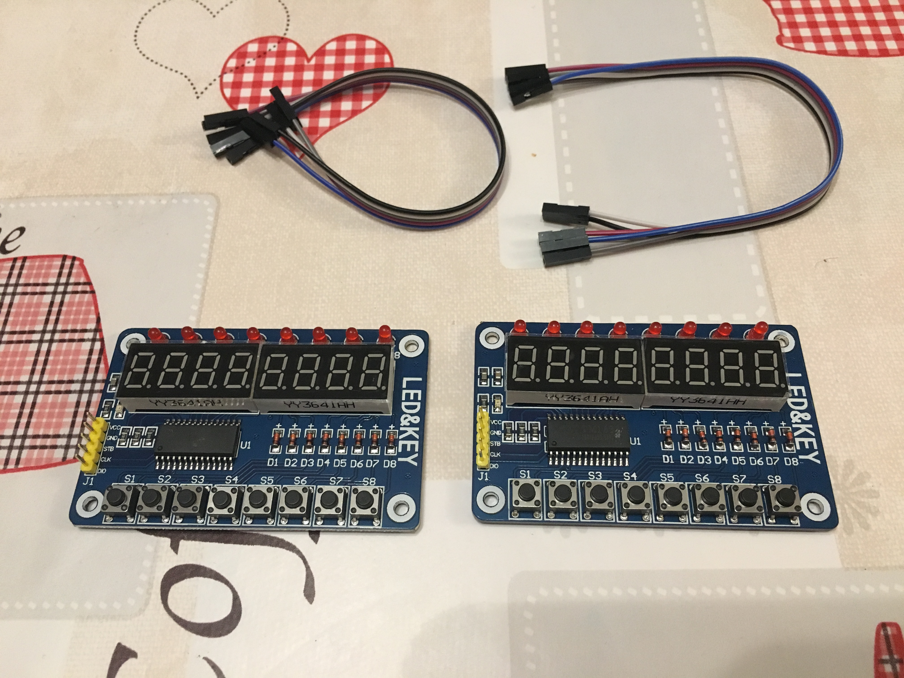
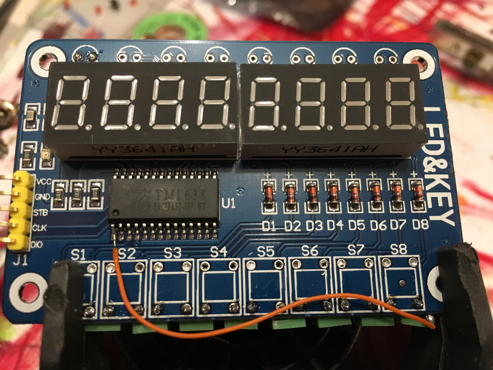
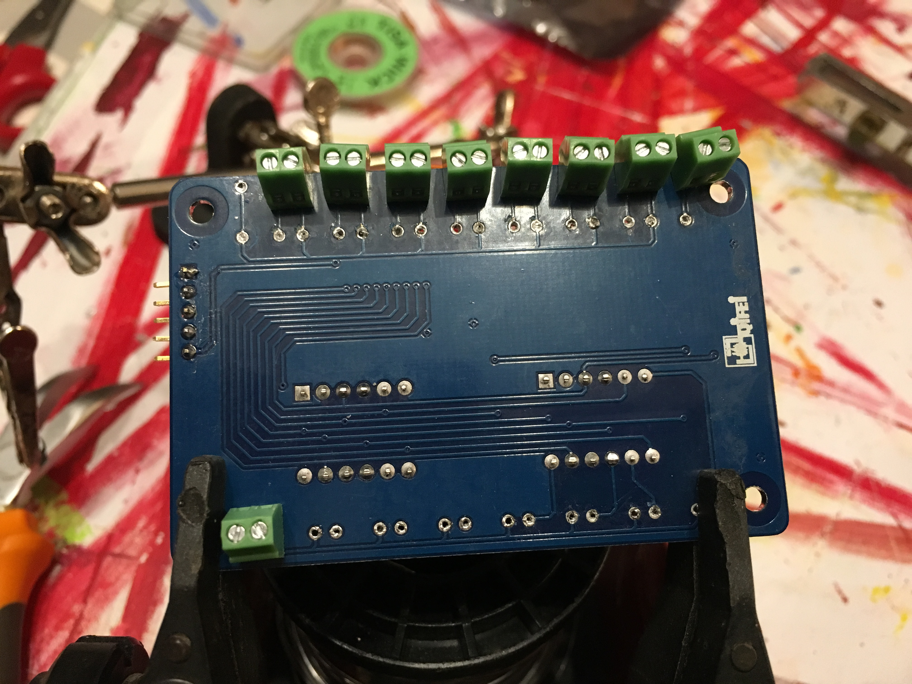

# TM1638

The TM1638 Board is a small board with a TM1638 IC, two groups of four 7-segment displays, 8 LEDs and 8 switches.
It is sometimes refered as TM1638 LED&KEY board (do not differ so much from the other boards, like the the QYF-TM1638 and JY-LKM1638)

It is a cheap (around 2$) board, and I have chose to use it because of its price, and its ability to chain several boards and control several LEDs, switches and 7-segment displays from the Raspberry Pi.

The idea (and maybe not the best idea) was to modify it so as to control extern LEDs, switches and bargraph (rather than the onboard ones). For the price, that was a good idea (these board are very cheap, but sometimes with a low finition: LEDs and displays are sometimes unaligned), but it gaves me a lot of work to unsolder the components. A better idea could be to directly buy a TM1638 IC and some 7-segment displays and make my own board (but I was affraid not to have time to make my own board).

## How it works ?
The TM1638 is a LED driver controller with key-scan interface, with serial interface.
It can drive up to 80 LEDs, and scan up to 30 switches.

The [datasheet](datasheet/TM1638en.pdf) badly explains how to exchange data with the TM1638, but you can find some tutorials online. Only 3 lines are necessary (plus `Vcc` and `Gnd`):
- `STB`: Chip select (Enable)
- `CLK`: clock for the serial communication
- `DIO`: Data Input Output
When `STB` is High, the data between the TM1638 board and the raspberry pi are exchanged using serial communication with `CLK` and `DIO`: in input mode (the TM board receive data), the data is read at the rising edge of the clock, and in output mode, the data is sent at the falling edge of the clock.

Some library exists (for arduino or Raspberry Pi), in C or in Python. But I was not convinced by the existing python libraries for Raspberry Pi (by their design and API), so I wrote (yet another) one (just for fun) you can find [here](https://github.com/thilaire/rpi-TM1638).

## Hack

I wanted to use it to control the different switches and LEDs (and bargraphes) of the different panels.

So, I had to unsolder some leds and switches and sold some screw block connectors.

The board used only 8 switches (it only addresses one input line), so I had to get, directly from the IC, the other input lines (named `K2` and `K3`, on pin 2 and 3):

## Pictures

