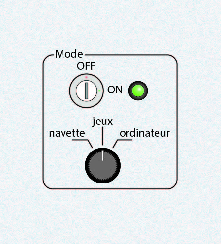
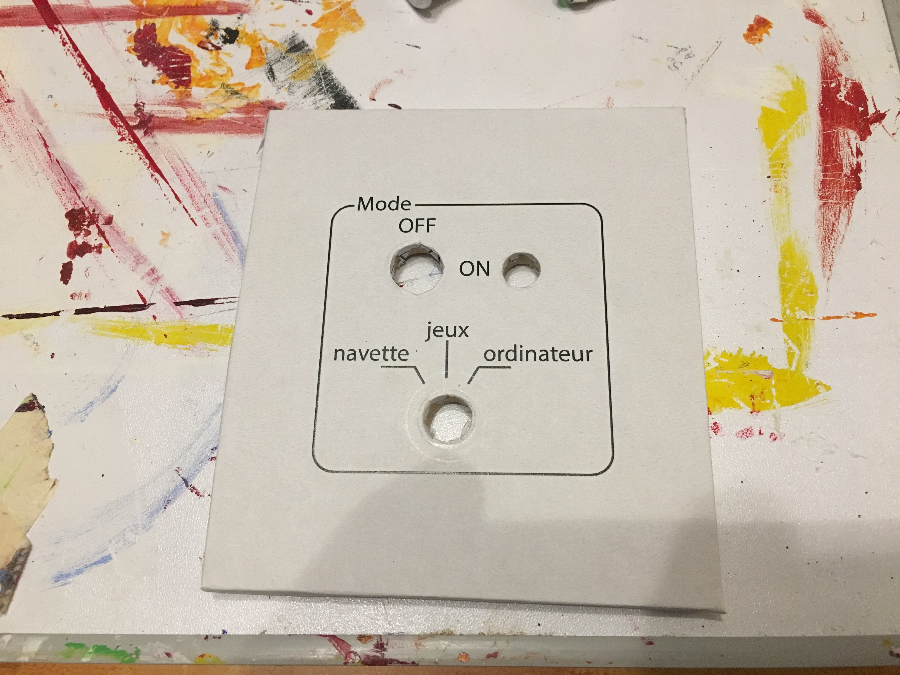
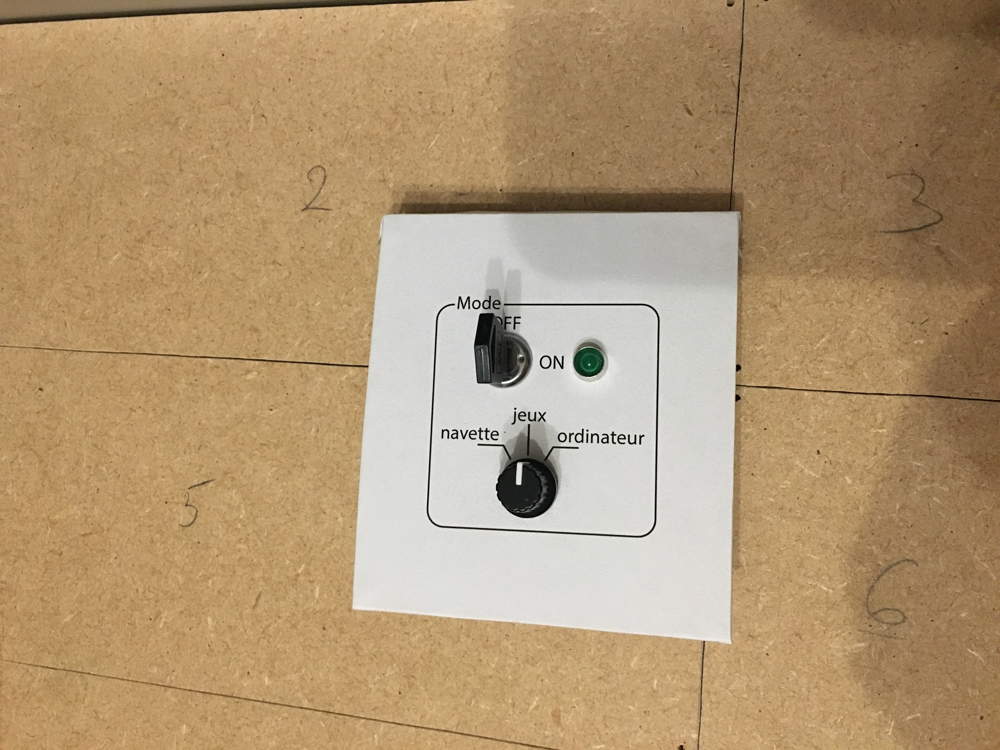

# 1) *Start/mode* panel

This panel is composed of:
- a key switch (`P1_SW-KEY`) for the on/off
- a green led (`P1_LED`) for the on/off
- a 3-position switch (`P1_SW3`) for the mode (spaceship/game/computer)

## Connections

| Switch     | TM | Line | Pin |
|:----------:|:--:|:----:|:---:|
| `P1_SW3:1` | 1  |  1   | 6   |
| `P1_SW2:2` | 1  |  1   | 7   |

`P1_LED` is directly connected to `GND` and `VCC` (with 500Ohm resistor).
`P1_SW-KEY` is between `VCC` and the +5V from the power supply. 

## Photos

