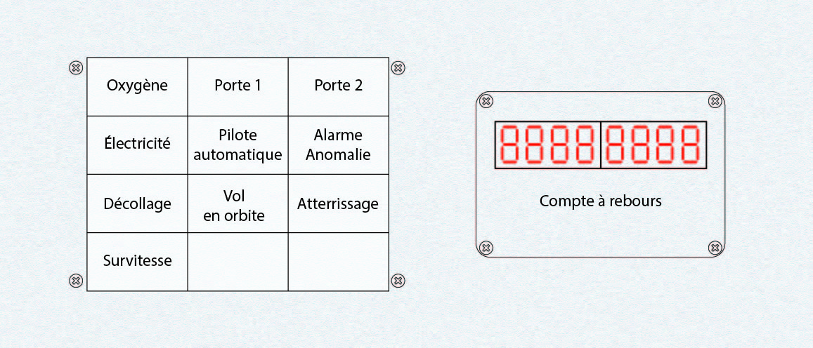
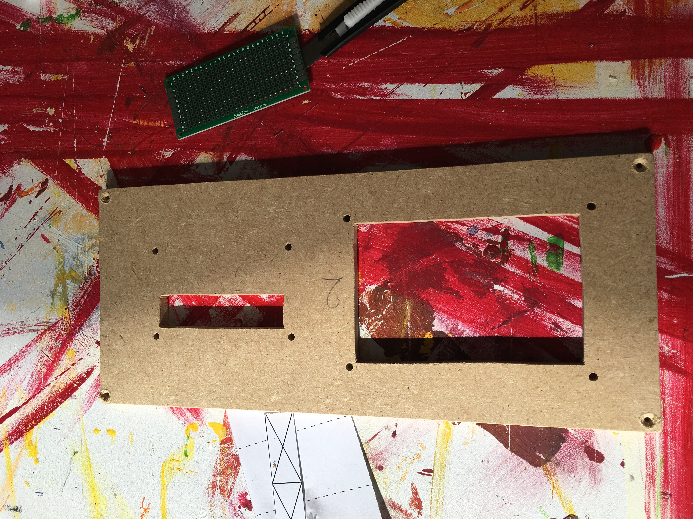
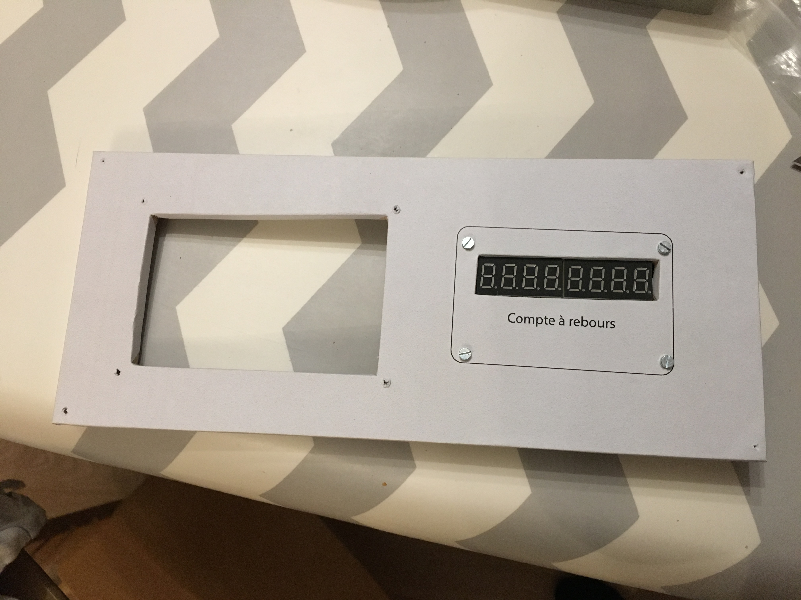

# 2) *Displays* panel

This panel is composed of:
- a set of 12 RGB LEDs (`P2_RGB_0` to `P2_RGB_11`)
- two blocks of four 7-segment displays (`P2_SSD_0` tp `P2_SSD_1`) for the countdown

The RGB LEDs are chained (the `Data_Out` of a LED is connected to the `Data_In` of the next LED), column by column.

| Column1                  | Column2                      | Column3               |
|:------------------------:|:----------------------------:|:---------------------:|
| `P2_RGB_0` (oxygen)      | `P2_RGB_4` (gate 1)          | `P2_RGB_8` (gate 2)   |
| `P2_RGB_1` (electricity) | `P2_RGB_5` (automatic pilot) | `P2_RGB_9` (alarm)    |
| `P2_RGB_2` (take-off)    | `P2_RGB_6` (orbit)           | `P2_RGB_10` (landing) |
| `P2_RGB_3` (overspeed)   | `P2_RGB_7`                   | `P2_RGB_11`           |

## Connections

The `Data_In` of the RGB LEDs comes from `` and the `Data_Out` goes to the `Data_In` of the chained RGB LEDS of the [panel 8](panels/8-commands/8.md).

The two SSD blocks are those of the TM board #1.

## Photos

