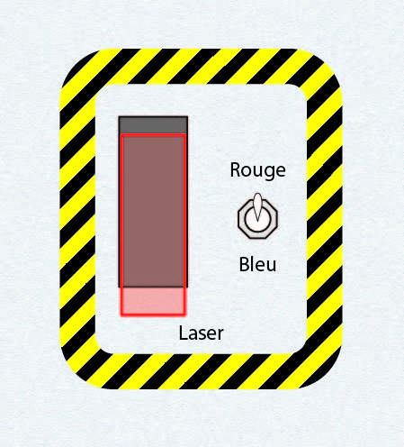
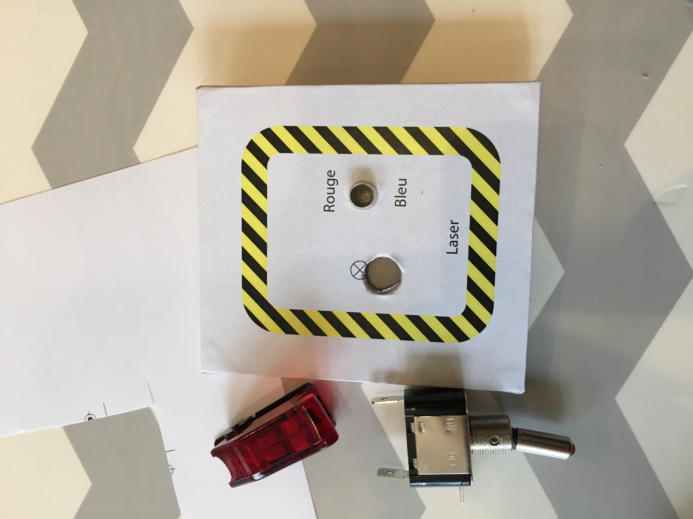

# 3) *Laser* panel

This panel is composed of:
- a rocket switch (`P3_SW2_0`) to arm the laser
- a 2-position toggle-switch (`P3_SW2_1`) for the color (red/blue)

## Connections

| Switch     | TM | Line | Pin |
|:----------:|:--:|:----:|:---:|
| `P3_SW2_0` | 1  |  2   | 1   |
| `P3_SW2_1` | 1  |  2   | 2   |

## Photos

