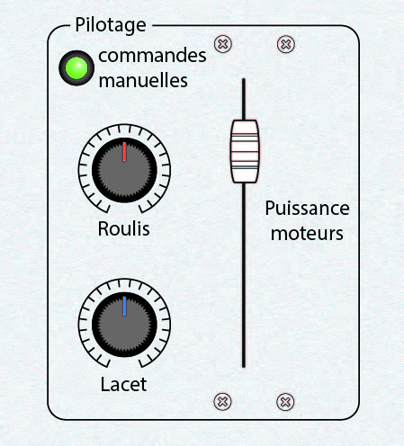

# 4) *Flight* panel

This panel is composed of:
- a LED (`P4_LED`) for the manual command
- two 10k$\Omega$ potentiometer (`P4_POT_0` and `P4_POT_1`)
- a inline potentiometer (`P4_POT_2`)

## Connections

| Element        | Connected to  |
|:--------------:|:-------------:|
| `P4_LED`       | `TM1_LED_8`   |
| `P4_POT_0`     | `AT_ADC3`     |
| `P4_POT_1`     | `AT_ADC4`     |
| `P4_POT_2`     | `AT_ADC5`     |

## Photos

