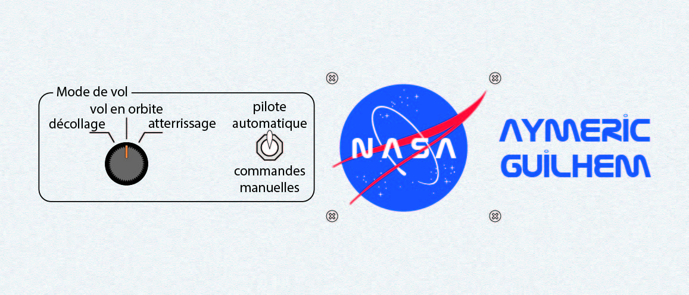

# 5) *Flight mode* panel

This panel is composed of:
- a 3-position switch (`P5_SW3`) for the flight mode (take-off/orbit/landing)
- a 2-position toggle switch (`P5_SW2`) for the autopilot (autopilot/manual)
- the Raspberry Pi

## Connections

## Photos

