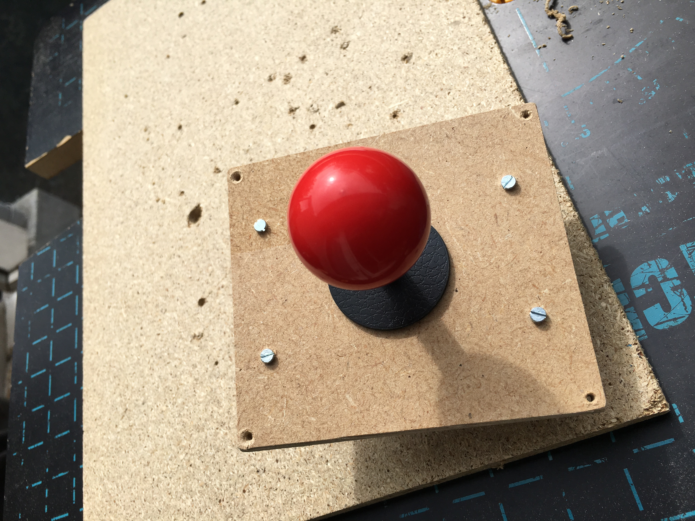

# 7) *Joystick* panel

This panel is composed of:
- a four-way arcade joystick (`P7_JOY_UP`, `P7_JOY_DOWN`, `P7_JOY_LEFT` and `P7_JOY_RIGHT`)

## Connections

These 4 input are connected to the following *pull-up* inputs (each switch of the joystick is connected to `P7_JOY_xxx` and `GND`)

| Swith         | Rpi IO   | Functionality  |
|:-------------:|:--------:|:--------------:|
| `P7_JOY_UP`    | `GPIO`   | Up             |
| `P7_JOY_DOWN`  | `GPIO`   | Down           |
| `P7_JOY_LEFT`  | `GPIO`   | Left           |
| `P7_JOY_RIGHT` | `GPIO`   | Right          |

## Photos

