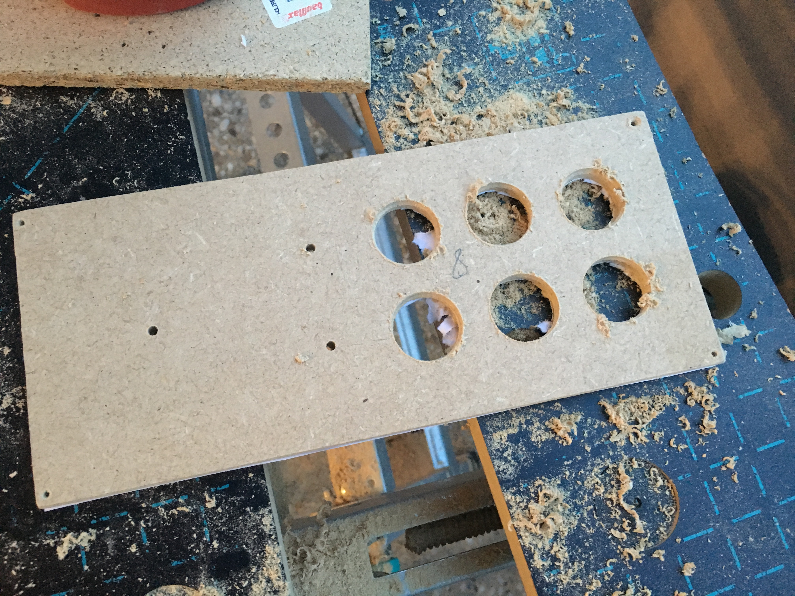
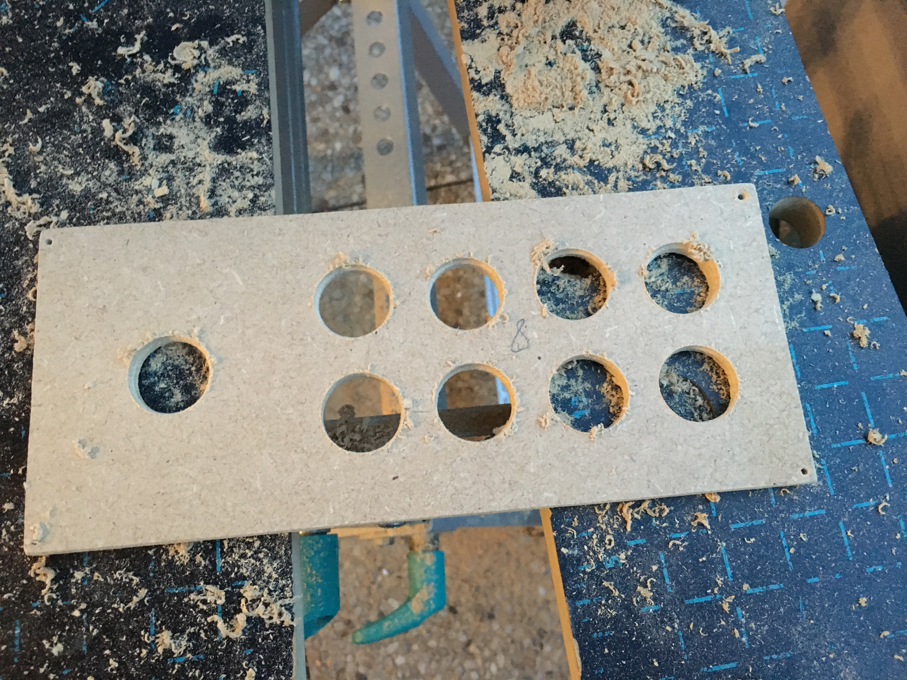
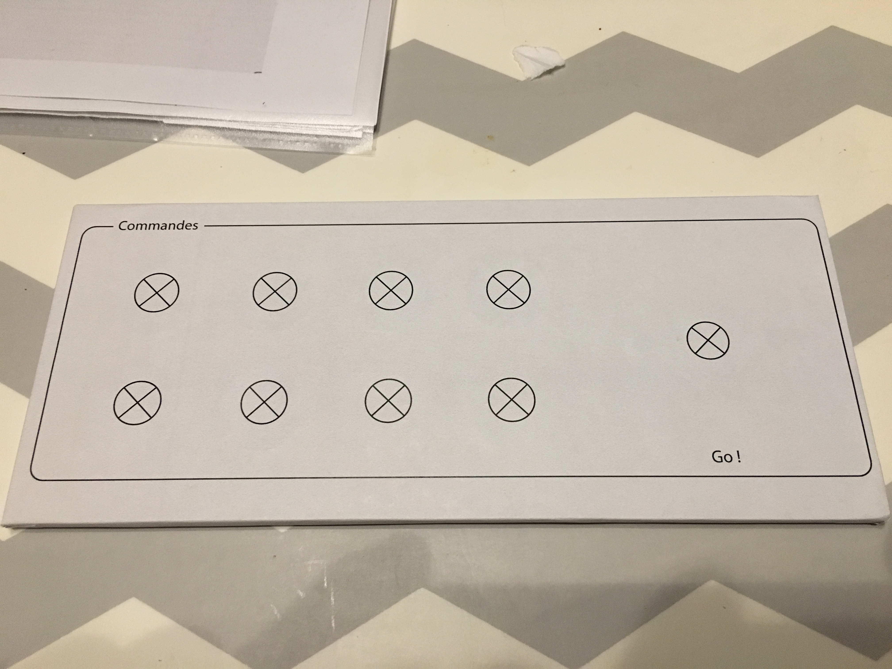
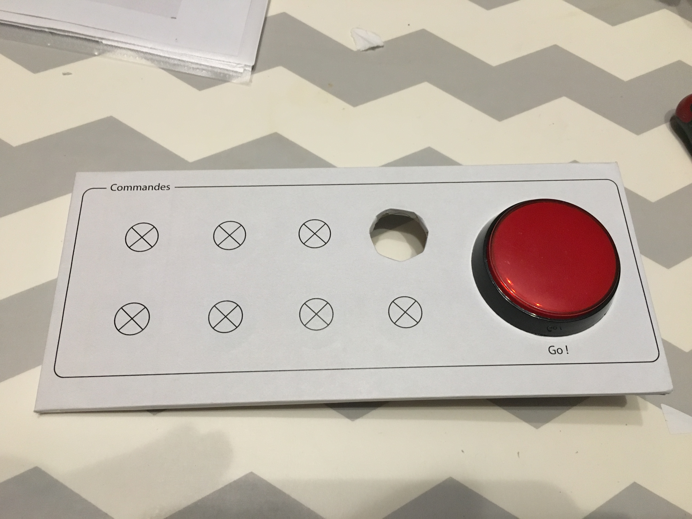
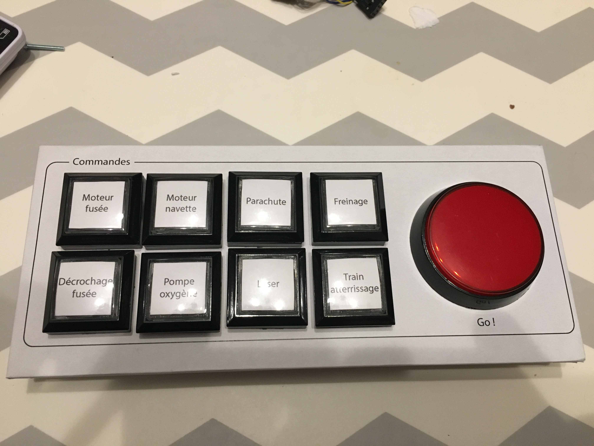

# 8) *Commands* panel

This panel is composed of:
- 8 arcade-style buttons:
  - push buttons (`8_PB_0` to `8_PB_7`)
  - with 8 RGB LEDs (`8_LED-RGB_0` to `8_LED-RGB_7`)
- 1 arcade-style red button:
  - a push buttons (`8_PB_8`)
  - a red LED (`8_LED`)

## Connections

| Functionality    | Push button | Led           | Input/Output  |
|:----------------:|:-----------:|:-------------:|:--------------:|
| Rocket engine    | `8_PB_0`    | `8_LED-RGB_0` |           |
| Spaceship rocket | `8_PB_1`    | `8_LED-RGB_1` |           |
| Parachute        | `8_PB_2`    | `8_LED-RGB_2` |           |
| Brake            | `8_PB_3`    | `8_LED-RGB_3` |           |
| unhook spaceship | `8_PB_4`    | `8_LED-RGB_4` |           |
| Oxygen Pump      | `8_PB_5`    | `8_LED-RGB_5` |           |
| Laser            | `8_PB_6`    | `8_LED-RGB_6` |           |
| Landing gear     | `8_PB_7`    | `8_LED-RGB_7` |           |
| Go!              | `8_PB_8`    | `8_LED`       |           |

## Photos

