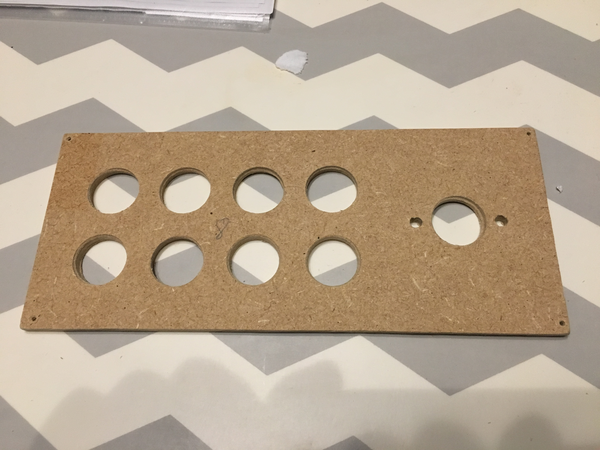
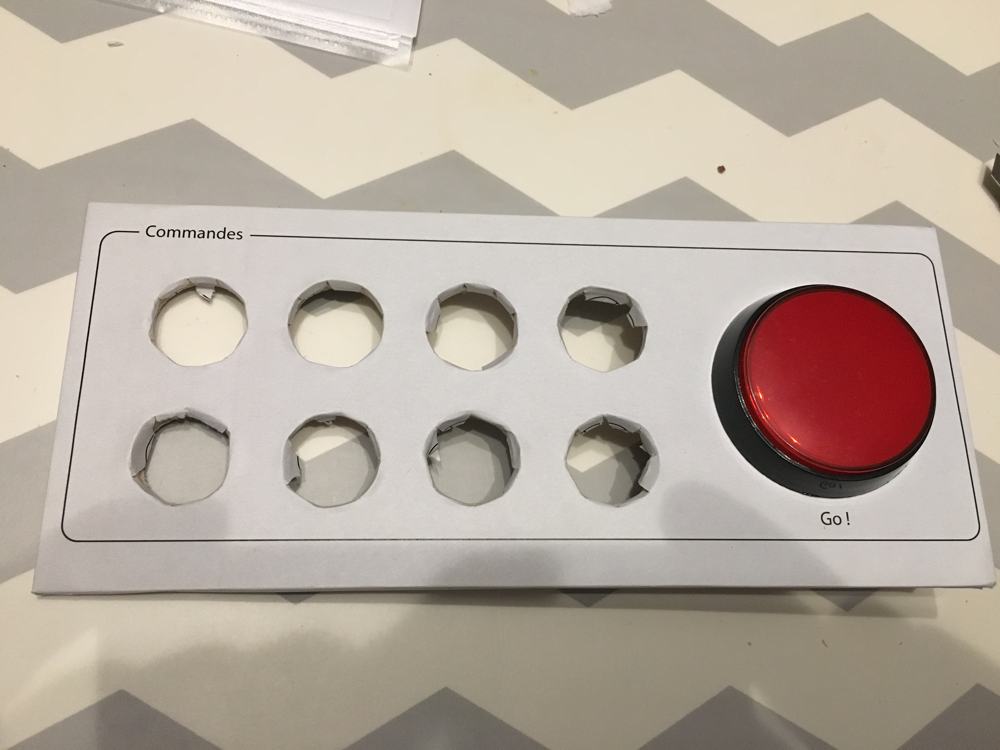
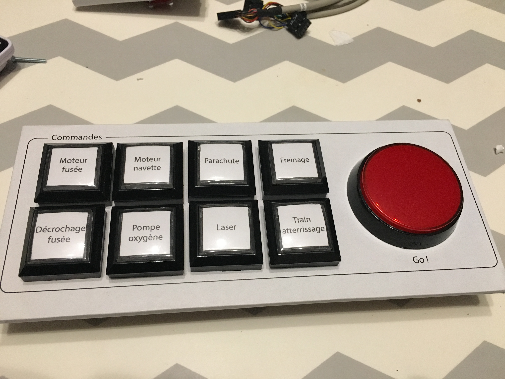

# 8) *Commands* panel

This panel is composed of:
- 8 arcade-style buttons:
  - push buttons (`P8_PB_0` to `P8_PB_7`)
  - with 8 RGB LEDs (`P8_RGB_0` to `P8_RGB_7`)
- 1 arcade-style red button:
  - a push buttons (`P8_PB_8`)
  - a red LED (`P8_LED`)

## Connections

The `Data_In` of the RGB LEDs comes from the `Data_Out` of the RGB LEDs of the [panel 2](panels/2-displays/2.md).
See [here](APA106.md) for more details on RGB LEDs.

| Functionality    | Push button | Led        | Input/Output  |
|:----------------:|:-----------:|:----------:|:-------------:|
| Rocket engine    | `P8_PB_0`   | `P8_RGB_0` |               |
| Spaceship rocket | `P8_PB_1`   | `P8_RGB_1` |               |
| Parachute        | `P8_PB_2`   | `P8_RGB_2` |               |
| Brake            | `P8_PB_3`   | `P8_RGB_3` |               |
| unhook spaceship | `P8_PB_4`   | `P8_RGB_4` |               |  
| Oxygen Pump      | `P8_PB_5`   | `P8_RGB_5` |               |
| Laser            | `P8_PB_6`   | `P8_RGB_6` |               |
| Landing gear     | `P8_PB_7`   | `P8_RGB_7` |               |
| Go!              | `P8_PB_8`   | `P8_LED`   |               |

## Photos

