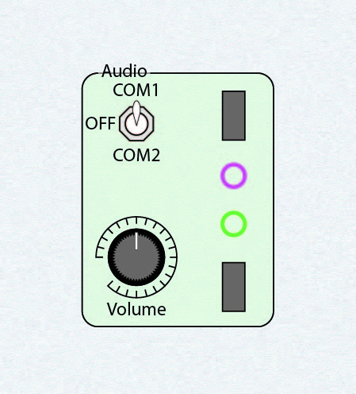
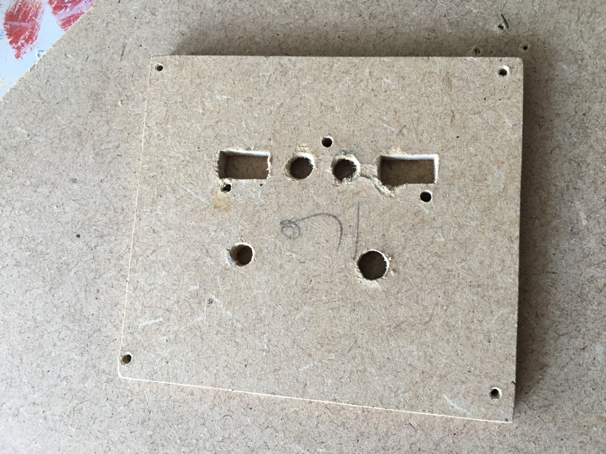
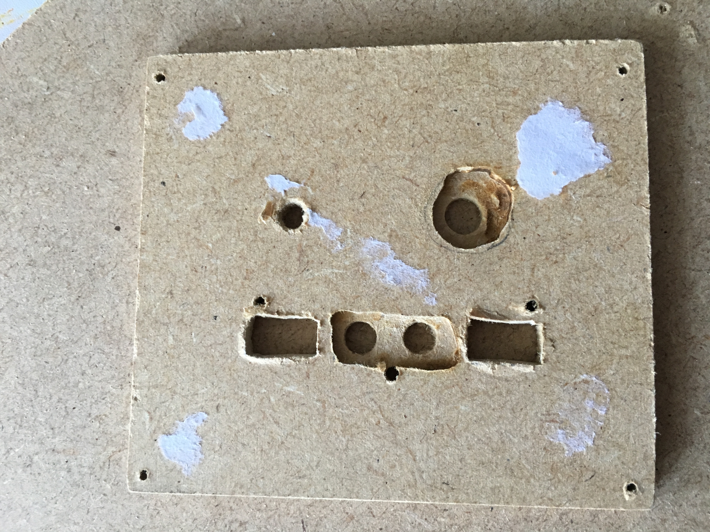
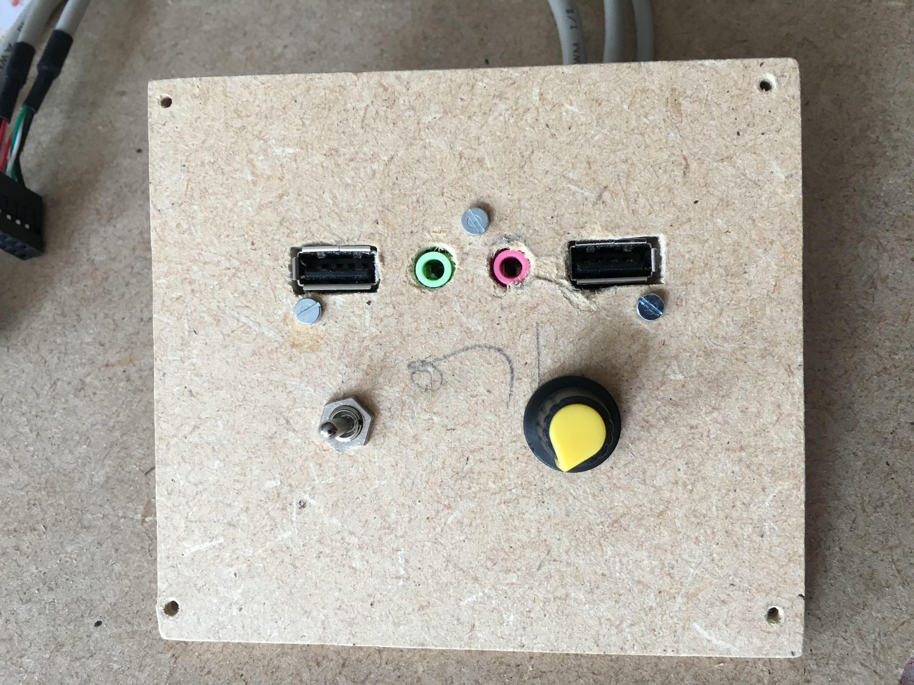
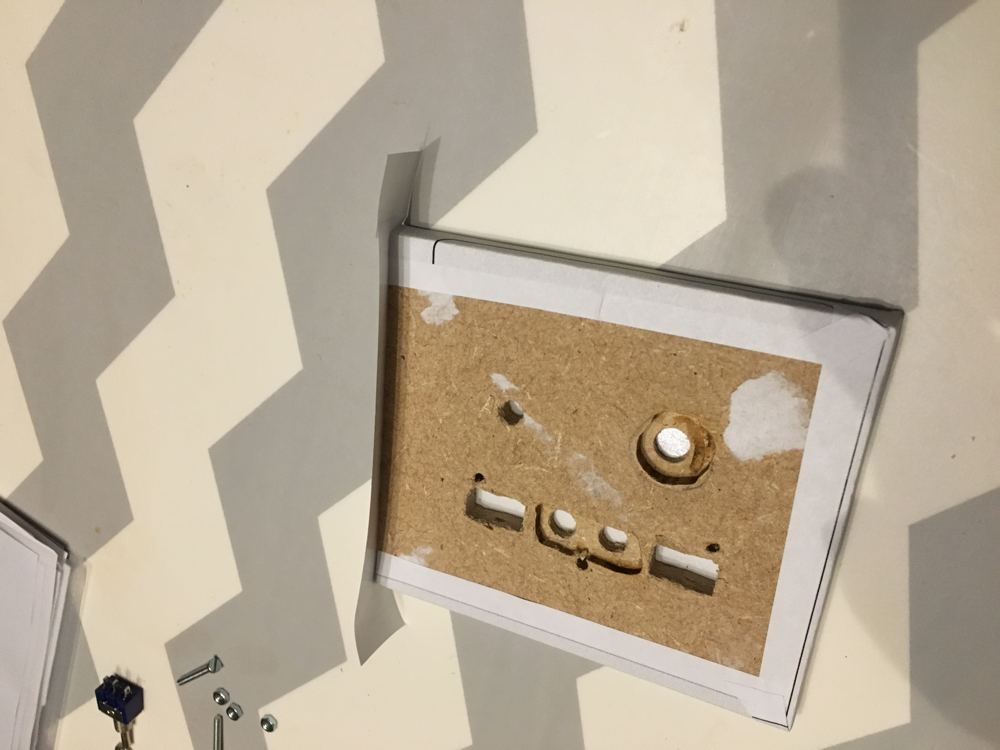
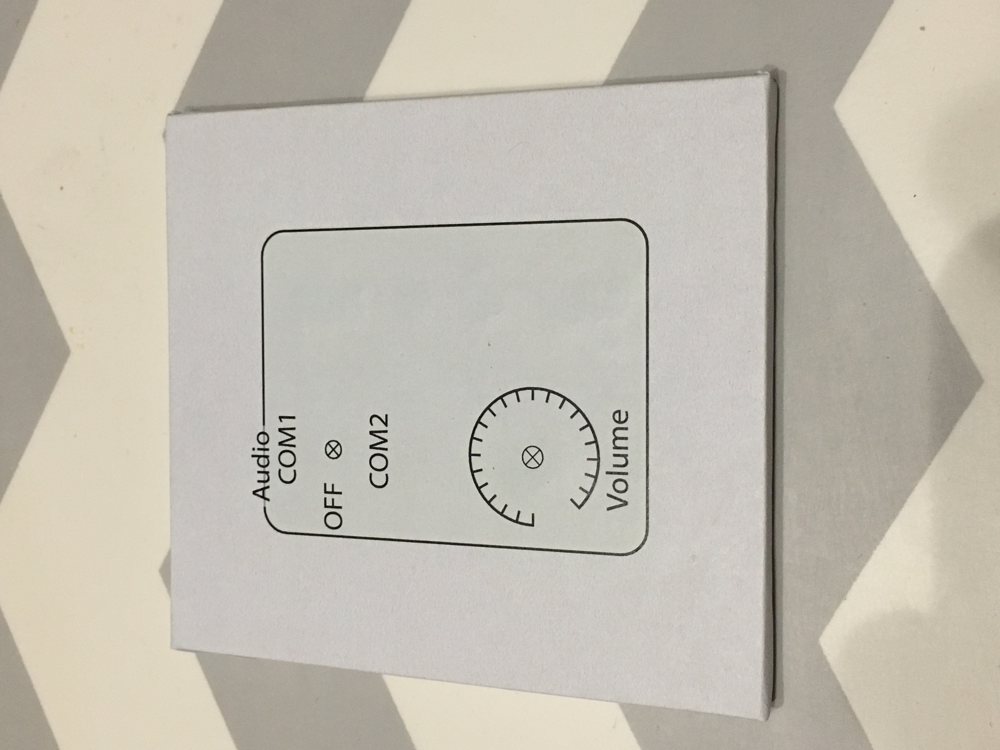
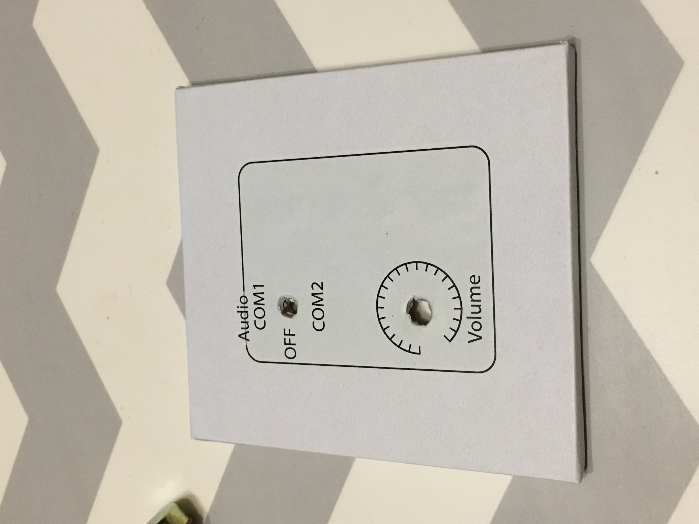
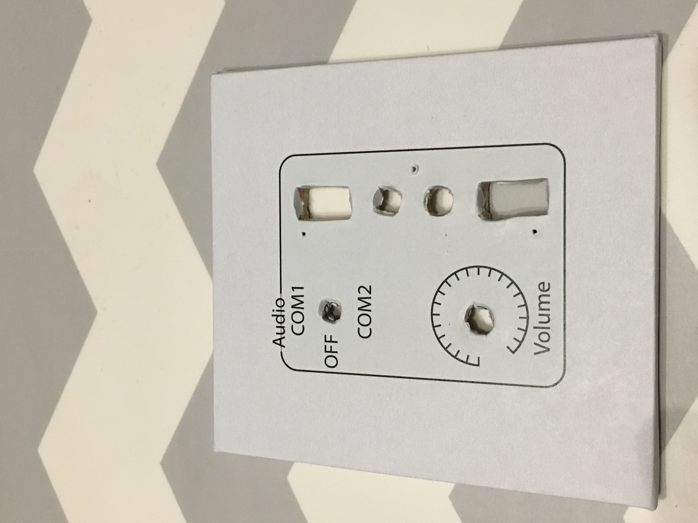
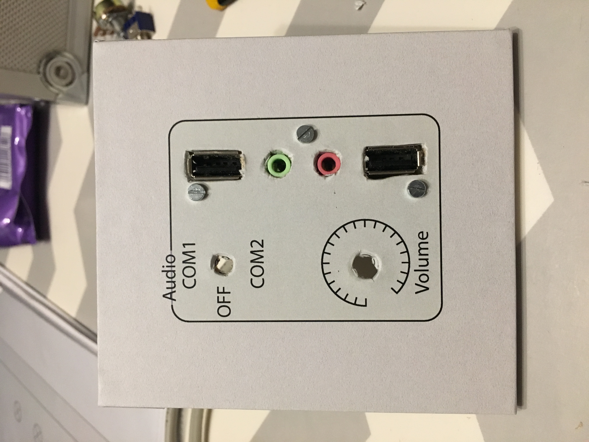
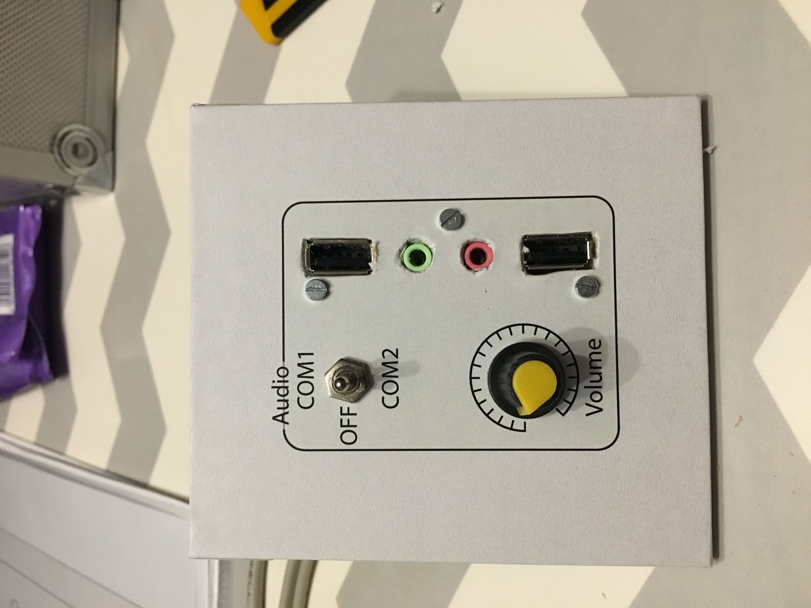

# 9) *Audio* panel

This panel is composed of:
- a three-state toggle switch (COM1/OFF/COM2) (`P9_SW-TOGGLE_0` and `P9_SW-TOGGLE_1`)
- a 10k$\Omega$ potentiometer (`P9_POT`)
- 2 USB female connector (`P9_USB_0`and `P9_USB_1`)
- 2 3.5mm audio jack connector (`P9_JACK_0` and `P9_JACK_1`)

## Connections

| Functionality           | name            | Input/Output  |
|:-----------------------:|:---------------:|:-------------:|
| USB (keyboard, etc.)    | `P9_USB_0`       | `RPi_USB_0`   |
| USB (keyboard, etc.)    | `P9_USB_1`       | `RPi_USB_1`   |
| potentiometer (volume)  | `P9_POT`         | ``            |
| toggle switch (COM1)    | `P9_SW-TOGGLE_0` |               |
| toggle switch (COM2)    | `P9_SW-TOGGLE_1` |               |
| audio jack 1            | `P9_JACK_0`      | |
| audio jack 1            | `P9_JACK_1`      | |

## Photos

