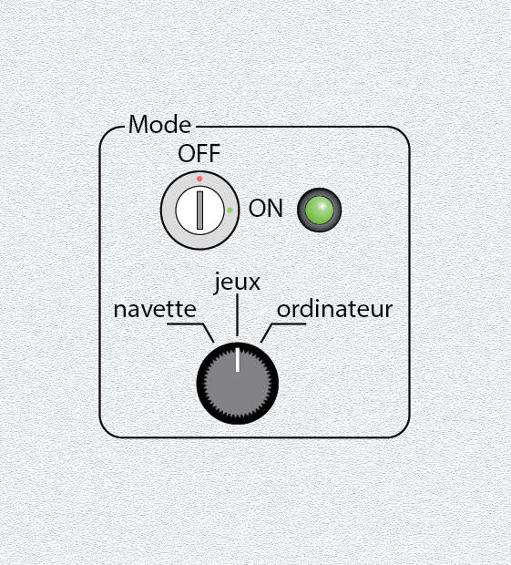

# Bottom 1) *Start/mode* panel

This panel is composed of:
- a key switch (`P1_SW-KEY`) for the on/off
- a green led (`P1_LED`) for the on/off
- a 3-position switch (`P1_SW3`) for the mode (spaceship/game/computer)

## Connections

| Switch     | TM | Pin |
|:----------:|:--:|:---:|
| `P1_SW3:1` | 4  | 0   |
| `P1_SW2:2` | 4  | 1   |

| LED      | TM | Pin |
|:--------:|:--:|:---:|
| `P1_LED` | 4  | 1   |

`P1_SW-KEY` is (for the moment) between `VCC` and the +5V from the power supply (it swithces on and off all the components of the board, including the Raspberry Pi). 

## Photos

