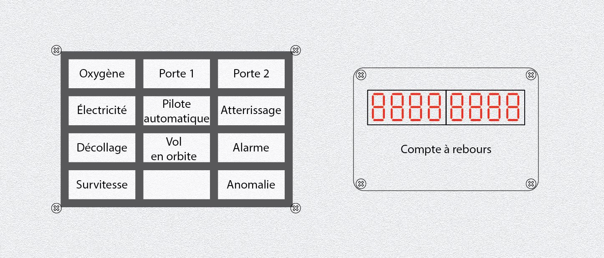

# Bottom 2) *Displays* panel

This panel is composed of:
- a set of 12 RGB LEDs (`B2_RGB_0` to `B2_RGB_11`, named `RGB_oxygen`, `RGB_electricity`, `RGB_takeoff`, `RGB_overspeed`, `RGB_gate1`, `RGB_automaticPilot`, `RGB_orbit` and `RGB_gate2`)
- a block of eight 7-segment displays (`B2_DISP`, aka `DISP_counter`) for the countdown/time

The RGB LEDs are chained (the `Data_Out` of a LED is connected to the `Data_In` of the next LED), column by column.

| Column1                        | Column2                           | Column3                     |
|:------------------------------:|:---------------------------------:|:---------------------------:|
| `B2_RGB_1` (`RGB_oxygen`)      | `B2_RGB_5` (`RGB_gate1`)          | `B2_RGB_9` (`RGB_gate2`)    |
| `B2_RGB_2` (`RGB_electricity`) | `B2_RGB_6` (`RGB_automaticPilot`) | `B2_RGB_10` (`RGB_alarm`)   |
| `B2_RGB_3` (`RGB_take-off`)    | `B2_RGB_7` (`RGB_orbit`)          | `B2_RGB_11` (`RGB_landing`) |
| `B2_RGB_4` (`RGB_overspeed`)   | `B2_RGB_8`                        | `B2_RGB_12`                 |

## Connections

The `B2_RGB_DIN` of the RGB LEDs comes from `AT_PA1` and the `B2_RGB_DOUT` goes to the Data_In `B8_RGB_DIN` of the chained RGB LEDS of the [panel 8](panels/8-commands/8.md).

The 7-segment displays are those of the TM board #4 (1st TM1638).

## Files
The [back](B2-back.pdf) and [label](B2-label.pdf) can be printed (100% scale, and vertical revert for the back).

## Photos

