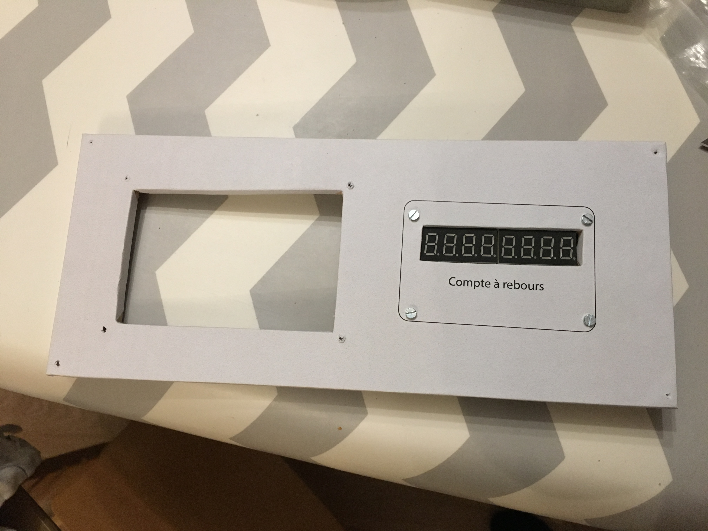

# 2) *Displays* panel

This panel is composed of:
- a set of 12 RGB LEDs (`P2_RGB_0` to `P2_RGB_11`)
- a blocks of height 7-segment displays (`P2_DISP`) for the countdown/time

The RGB LEDs are chained (the `Data_Out` of a LED is connected to the `Data_In` of the next LED), column by column.

| Column1                  | Column2                      | Column3               |
|:------------------------:|:----------------------------:|:---------------------:|
| `P2_RGB_1` (oxygen)      | `P2_RGB_5` (gate 1)          | `P2_RGB_9` (gate 2)   |
| `P2_RGB_2` (electricity) | `P2_RGB_6` (automatic pilot) | `P2_RGB_10` (alarm)    |
| `P2_RGB_3` (take-off)    | `P2_RGB_7` (orbit)           | `P2_RGB_11` (landing) |
| `P2_RGB_4` (overspeed)   | `P2_RGB_8`                   | `P2_RGB_12`           |

## Connections

The `P2_RGB_DIN` of the RGB LEDs comes from `AT_PA1` and the `P2_RGB_DOUT` goes to the Data_In `P8_RGB_DIN` of the chained RGB LEDS of the [panel 8](panels/8-commands/8.md).

The 7-segment displays are those of the TM board #4 (1st TM1638).

## Files
The [back](B2-back.pdf) and [label](B2-label.pdf) can be printed (100% scale, and vertical revert for the back).

## Photos

