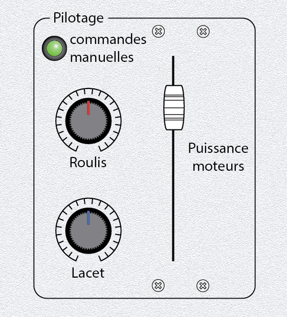
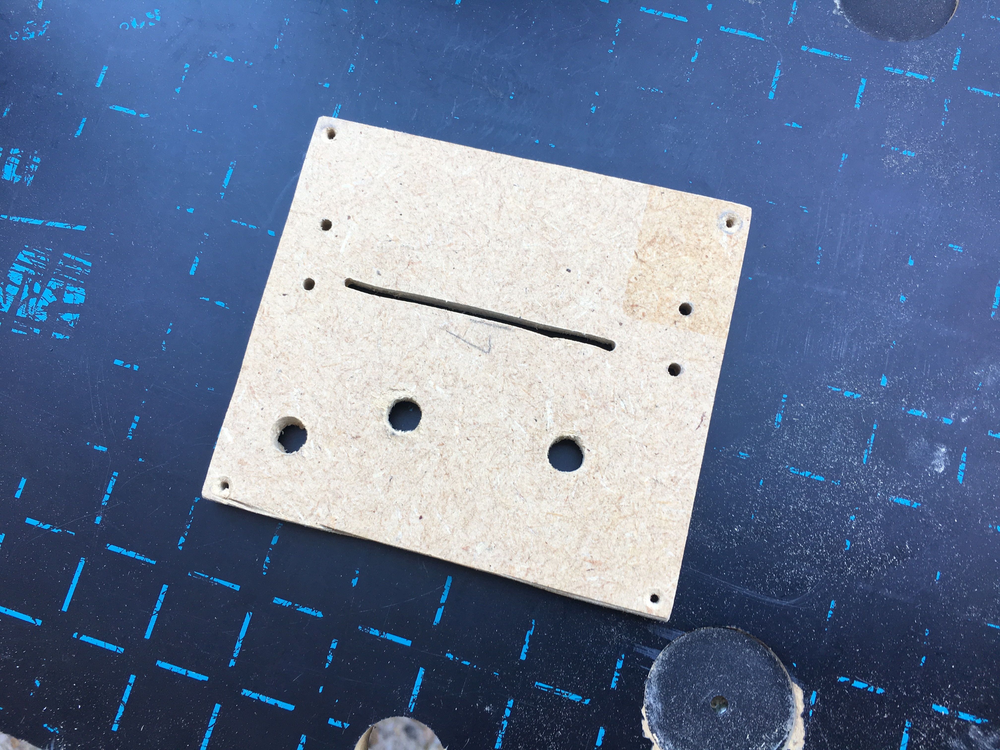

# 4) *Flight* panel

This panel is composed of:
- a LED (`P4_LED`) for the manual command
- two 10k$\Omega$ potentiometer (`P4_POT_0` and `P4_POT_1`)
- a inline potentiometer (`P4_POT_2`)

## Connections

| Element        | Function | Connected to            |
|:--------------:|:--------:|:-----------------------:|
| `P4_LED`       | manual   | TM #4, pin 0            |
| `P4_POT_0`     | roll     | `AT_ADC3` (ADC index 0) |
| `P4_POT_1`     | yaw      | `AT_ADC4` (ADC index 1) |
| `P4_POT_2`     | speed    | `AT_ADC5` (ADC index 2) |

## Files
The [back](B4-back.pdf) and [label](B4-label.pdf) can be printed (100% scale, and vertical revert for the back).

## Photos

