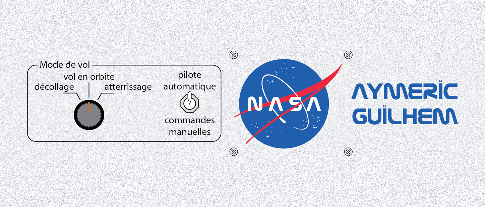
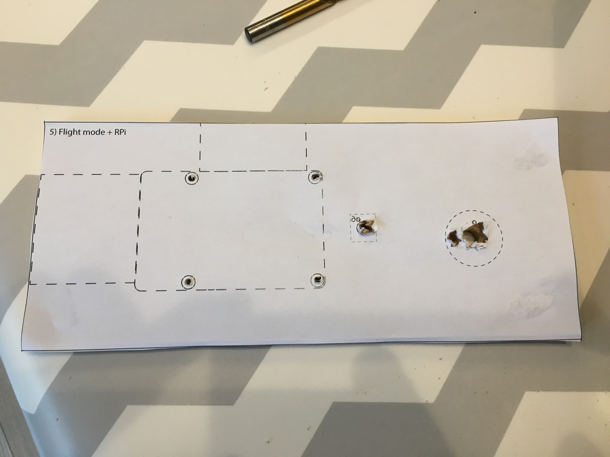
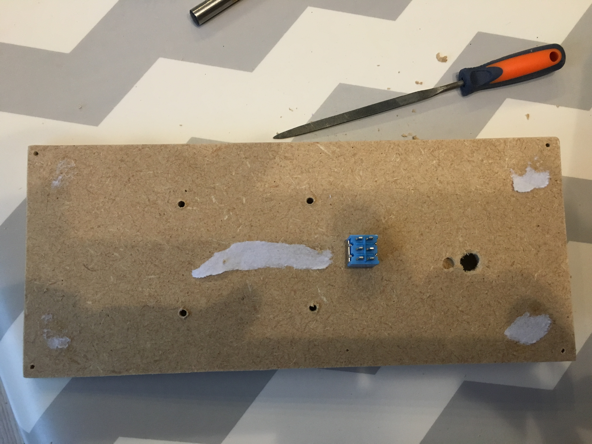
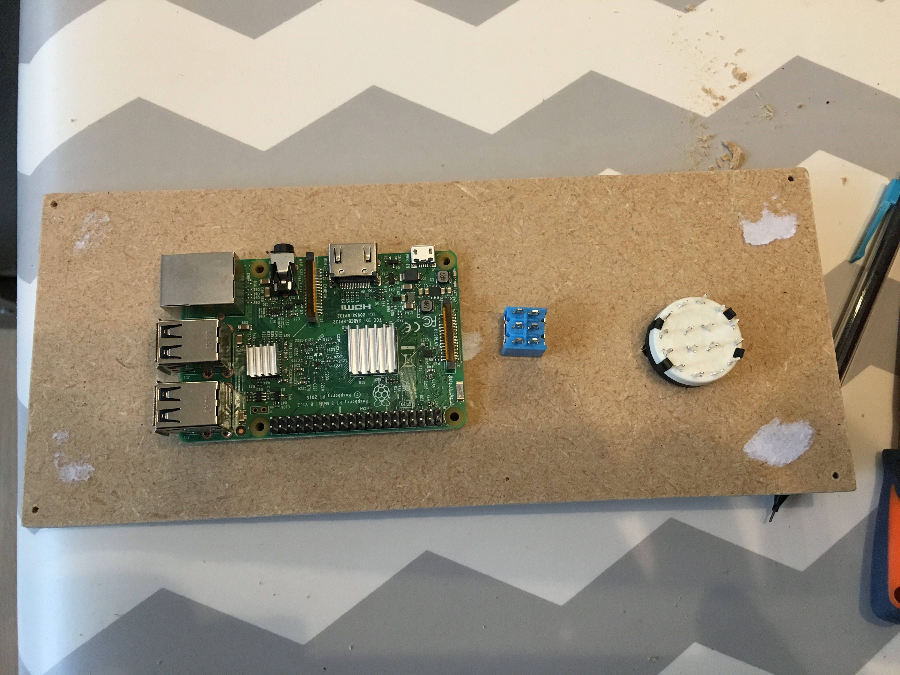
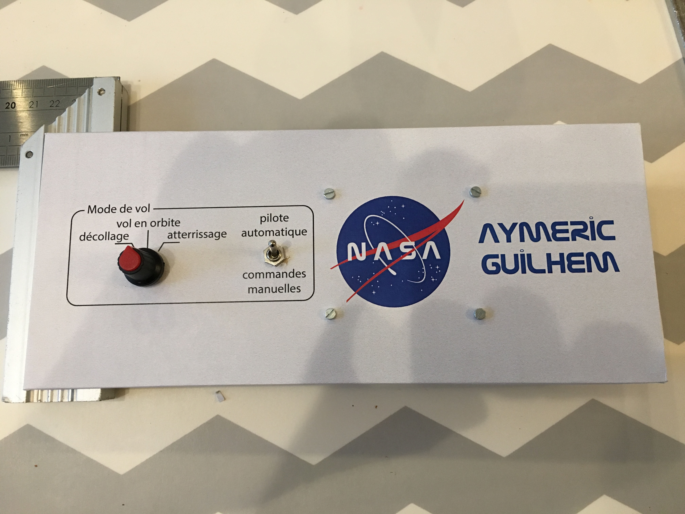

# Bottom 5) *Flight mode* panel

This panel is composed of:
- a 3-position switch (`P5_SW3`) for the flight mode (take-off/orbit/landing)
- a 2-position toggle switch (`P5_SW2`) for the autopilot (autopilot/manual)
- the Raspberry Pi

## Connections

| Switch     | Function    | TM | Pin |
|:----------:|:-----------:|:--:|:---:|
| `P5_SW2`   | autopilot   | 4  | 4   |
| `P5_SW3:1` | flight mode | 4  | 2   |
| `P5_SW2:2` | flight mode | 4  | 3   |

## Files
The [back](B5-back.pdf) and [label](B5-label.pdf) can be printed (100% scale, and vertical revert for the back).

## Photos

