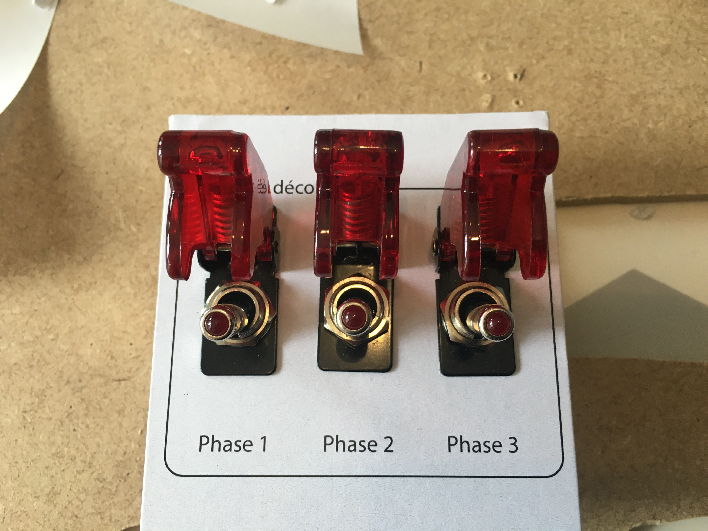

# Bottom 6) *Lift-off phases* panel

This panel is composed of:
- three rocket-style switches (`B6_SW2_0` to `B6_SW2_2`, aka `SW2_phase1`, `SW2_phase2` and `SW2_phase3`) for the different phases

## Connections

The switches `B6_SW2_0`, `B6_SW2_1` and `B6_SW2_2` are connected to the analog port `AT_PC2` (see [how to put several digital input on a single analog input](../../multiple-inputs.md)), on position `1`, `2`, `3` and `4` respectively. They are seen (from the Raspberry Pi) as input from TM#7, on pin 7, 5 and 6 respectively.

## Files
The [back](B6-back.pdf) and [label](B6-label.pdf) can be printed (100% scale, and vertical revert for the back).

## Photos

