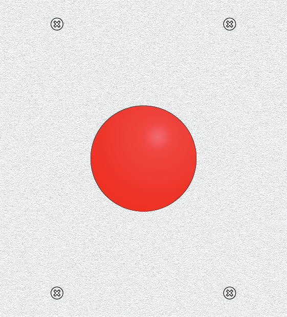

# 7) *Joystick* panel

This panel is composed of:
- a four-way arcade joystick (`P7_JOY_UP`, `P7_JOY_DOWN`, `P7_JOY_LEFT` and `P7_JOY_RIGHT`), each entry is considered as a push-button.

## Connections

These 4 input are connected to the following *pull-up* inputs (each switch of the joystick is connected to `P7_JOY_xxx` and `GND`)

| Switch         | Rpi IO    | Functionality  |
|:--------------:|:---------:|:--------------:|
| `P7_PB_UP`    | `RPi_IO7`  | Up             |
| `P7_PB_DOWN`  | `RPi_IO5`  | Down           |
| `P7_PB_LEFT`  | `RPi_IO12` | Left           |
| `P7_PB_RIGHT` | `RPi_IO6`  | Right          |

## Files
The [back](B7-back.pdf) and [label](B7-label.pdf) can be printed (100% scale, and vertical revert for the back).

## Photos

