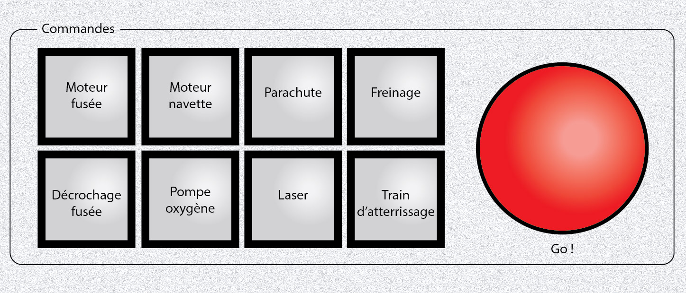
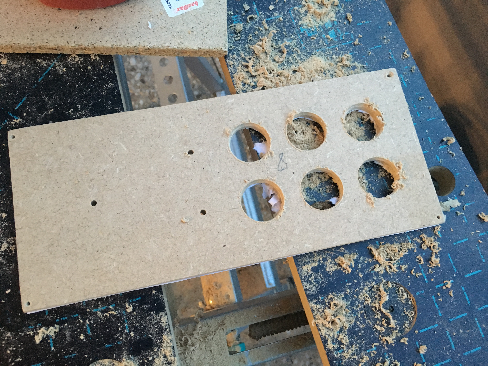
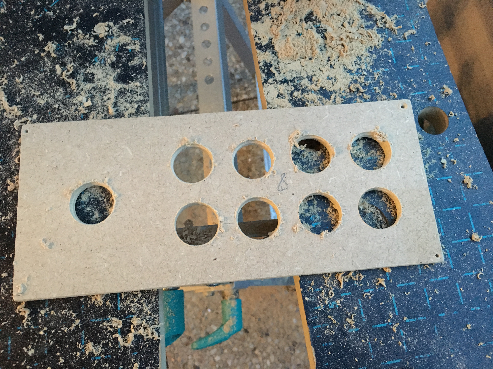
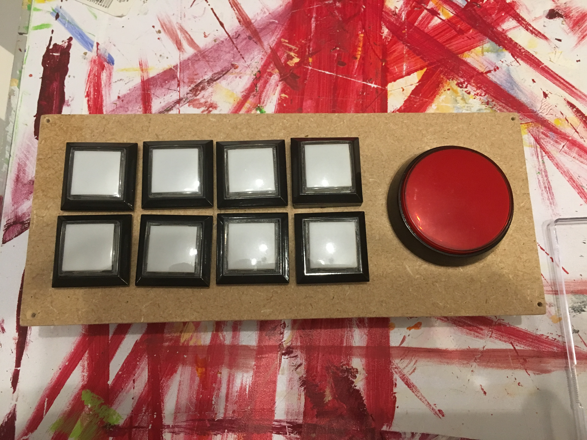
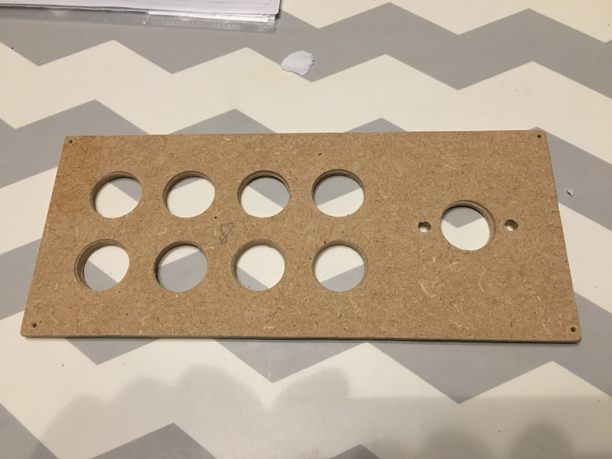
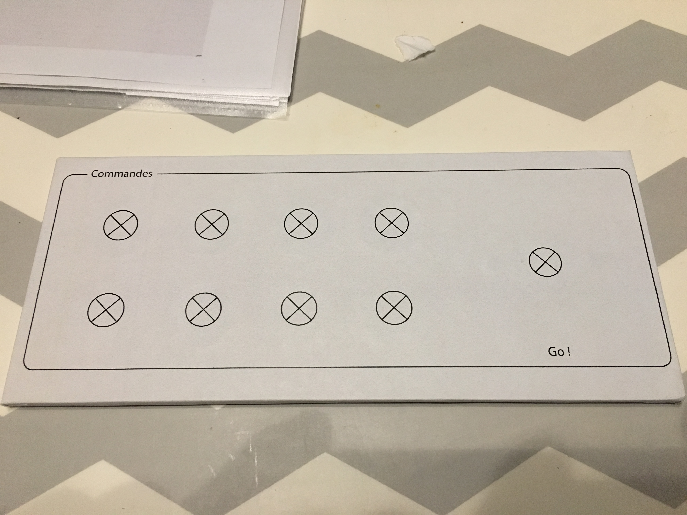
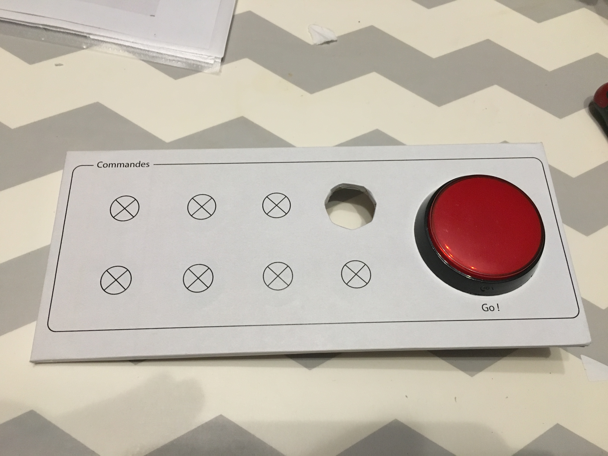
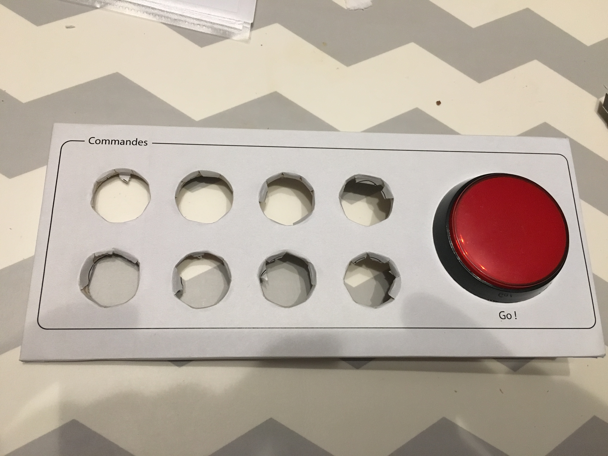
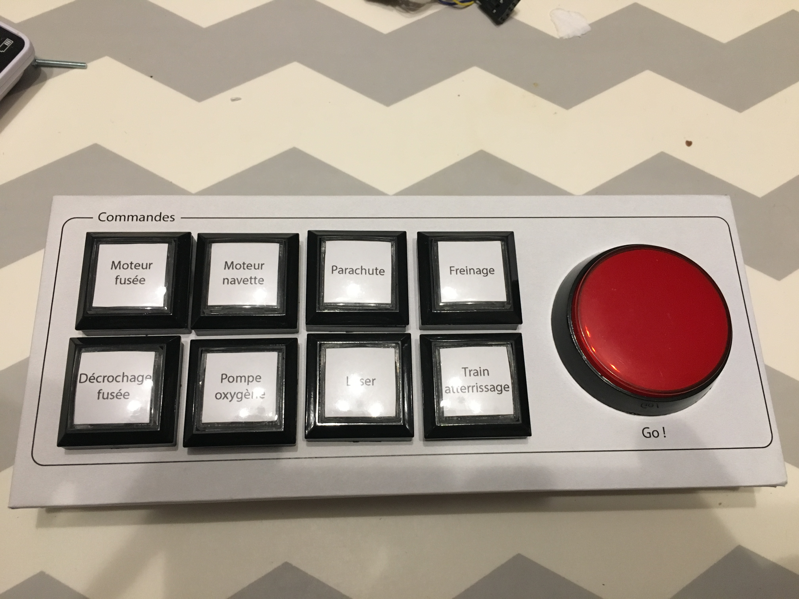
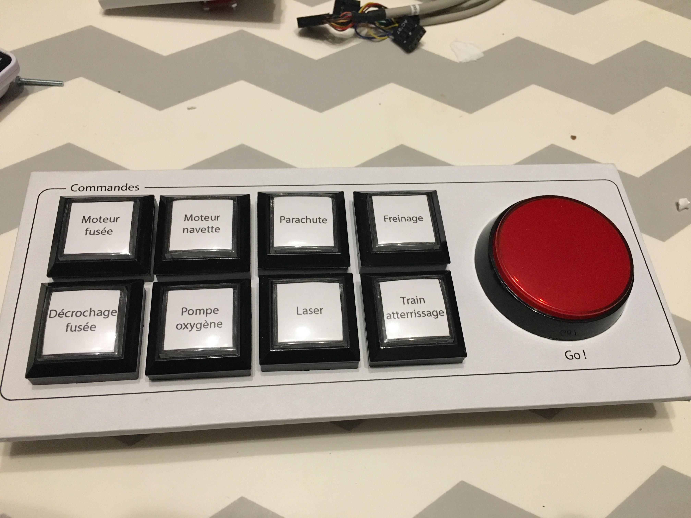

# Bottom 8) *Commands* panel

This panel is composed of:
- 9 arcade-style buttons:
  - push buttons (`B8_PB_0` to `B8_PB_8`)
  - with 9 RGB LEDs (`B8_RGB_0` to `B8_RGB_8`)
(the last one is a big red button)

## Insert the RGB Led into the buttons

The arcade-style push buttons are delivered with a simple white LED inside.
But it is not difficult to remove that LED and install instead a RGB LED like the [WS2812 or clones](APA106.md). It just requires to drew a little bit the plastic support and wire correctly the LED. See the pictures or [this guide](http://www.instructables.com/id/Arcade-Button-RGB-LED-Conversion/) (in my version, I have decided to keep the original LED connectors, used for `GND` and `VCC` for all the LED. It reduces a lot the number of wires !).

## Connections

The `Data_In` of the RGB LEDs comes from the `Data_Out` of the RGB LEDs of the [panel 2](panels/2-displays/2.md).
See [here](APA106.md) for more details on RGB LEDs.

| Functionality    | Push button | Led        | Input/Output  |
|:----------------:|:-----------:|:----------:|:-------------:|
| Rocket engine    | `B8_PB_0`   | `B8_RGB_0` |  `RPi_IO4`    |
| Spaceship rocket | `B8_PB_1`   | `B8_RGB_1` |  `RPi_IO18`   |
| Parachute        | `B8_PB_2`   | `B8_RGB_2` |  `RPi_IO27`   |
| Brake            | `B8_PB_3`   | `B8_RGB_3` |  `RPi_IO17`   |
| unhook spaceship | `B8_PB_4`   | `B8_RGB_4` |  `RPi_IO14`   |  
| Oxygen Pump      | `B8_PB_5`   | `B8_RGB_5` |  `RPi_IO3`    |
| Laser            | `B8_PB_6`   | `B8_RGB_6` |  `RPi_IO2`    |
| Landing gear     | `B8_PB_7`   | `B8_RGB_7` |  `RPi_IO15`   |
| Go!              | `B8_PB_8`   | `B8_RGB_8` |  `RPi_IO22`   |

## Files
The [back](B8-back.pdf) and [label](B8-label.pdf) (plus the [buttons](B8-button-label.pdf))can be printed (100% scale, and vertical revert for the back).

## Photos

