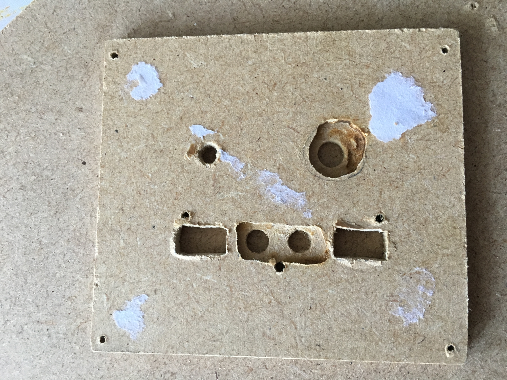
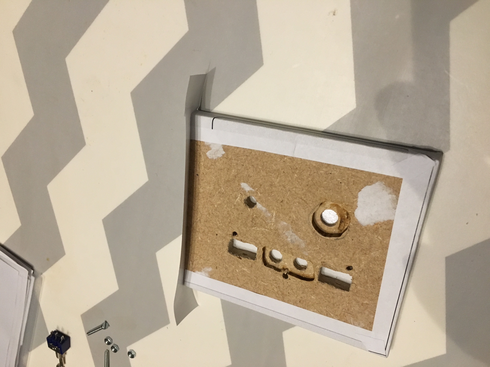
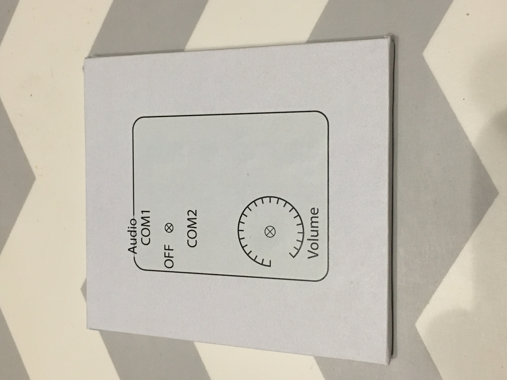
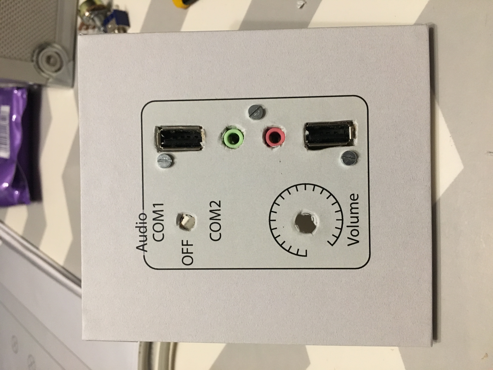
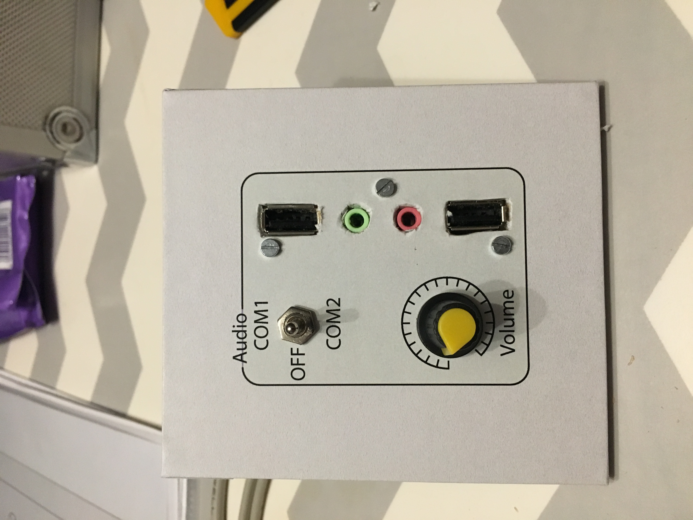

# Bottom 9) *Audio* panel

This panel is composed of:
- a three-state toggle switch (COM1/OFF/COM2) (`B9_SW3`, aka `SW3_Com`)
- a 10k$\Omega$ potentiometer (`B9_POT`)
- 2 USB female connector (`B9_USB_0`and `B9_USB_1`)
- 2 3.5mm audio jack connector (`B9_JACK_0` and `B9_JACK_1`)

## Connections

| Functionality           | name        | Input/Output       |
|:-----------------------:|:-----------:|:------------------:|
| USB (keyboard, etc.)    | `B9_USB_0`  | `RPi_USB_0`        |
| USB (keyboard, etc.)    | `B9_USB_1`  | `RPi_USB_1`        |
| potentiometer (volume)  | `B9_POT`    |                    |
| toggle 3-pos switch     | `B9_SW3:1`  | TM#4, Pin 5        |
| toggle 3-pos switch     | `B9_SW3:2`  | TM#4, Pin 6        |
| audio jack 1            | `B9_JACK_0` |                    |
| audio jack 1            | `B9_JACK_1` |                    |

## Files
The [back](B9-back.pdf) and [label](B9-label.pdf) can be printed (100% scale, and vertical revert for the back).

## Photos

