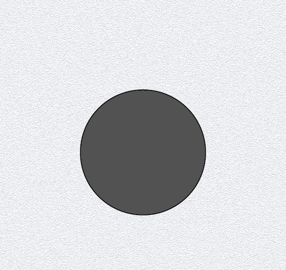

# Top 1) Hole (for the joystick in the bottom)

This panel is empty (just a hole for the joystick of the bottom panel, that is too high).

## Connections

## Files
The [back](T1-back.pdf) and [label](T1-label.pdf) can be printed (100% scale, and vertical revert for the back).

## Photos
