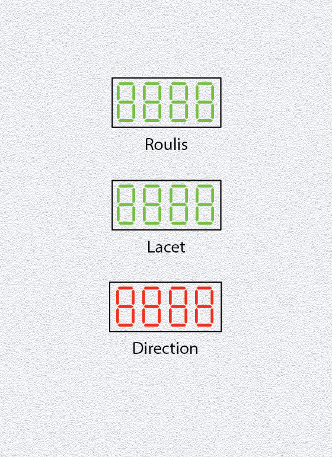

# Top 4) attitude displays

This panel is composed of:
- a green four 7-segment display for the roll (`T4_DISP_1` aka `DISP_roll`)
- a green four 7-segment display for the yaw (`T4_DISP_2` aka `DISP_yaw`)
- a red eight 7-segment display for the direction (`T4_DISP_3`, aka `DISP_direction`)

## Connections
- `T4_DISP_1` is the display of the TM1637 #2
- `T4_DISP_2` is the display of the TM1637 #3 
- `T4_DISP_3` is the display of the TM1638 #7

## Files
The [back](T4-back.pdf) and [label](T4-label.pdf) can be printed (100% scale, and vertical revert for the back).

## Photos
