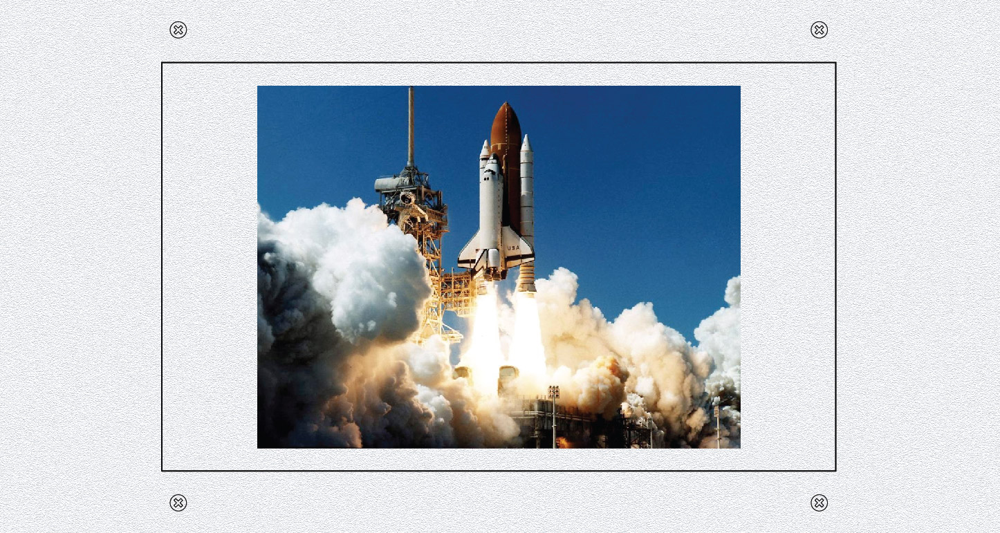

# Top 5) Screen 

This panel is only composed of the touch screen (a 7-inch touch screen LCD (7-inch 800x480 HDMI LCD (B) from [waveshare](https://www.waveshare.com/wiki/7inch_HDMI_LCD_(B))): 52€ at [amazon](https://www.amazon.fr/gp/product/B01HPV6RUS/ref=oh_aui_detailpage_o07_s00)).

## Connections
The HDMI and mini-USB port of the touch screen are connected (with flat cable) to the Raspberry Pi.

## Files
The [back](T5-back.pdf) and [label](T5-label.pdf) can be printed (100% scale, and vertical revert for the back).

## Photos
