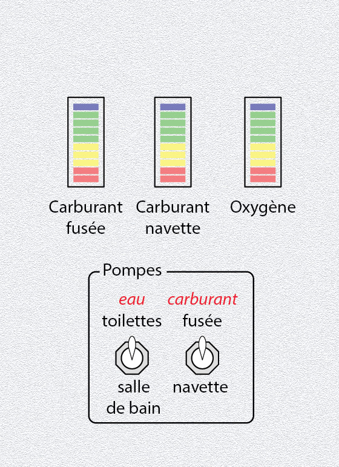

# Top 6) levels

This panel is composed of:
- three 10-point bargraphes (`T6_LVL_1` aka `LVL_fuel_rocket`, `T6_LVL_2` aka `LVL_fuel_spaceship` and `T6_LVL_3` aka `LVL_oxygen`)
- two 3-position switches (`T6_SW3_1` aka `SW3_water_pump` and `T6_SW3_2`aka `SW3_fuel_pump`) for the water (to turn on the pump for the toilets, the bathroom, or to turn it off) and fuel pump (to the spaceship or the rocket, or to turn it off)

The bargraphes are colored bargraphes (from bottom to top: 2 red, 3 yellow, 4 green and 1 blue).

## Connections
- the three bargraphes are connected to the second four 7-segment display of the TM board #7. Leds 3 to 10 of the bargraphes are connected to the 8 leds of the 7-segment display (in the right order, ie led 3 connected to segment *a*, led 4 to segment *b*, and so on...). The last 7-segment display is used for the leds 1 and 2 of the bargraphes.

(TODO: add a schematic)

- the water pump switch is connected to pins 3 and 2 of the TM Board #5
- the fuel pump switch is connected to pins 4 and 5 of the TM Board #5

## Files
The [back](T6-back.pdf) and [label](T6-label.pdf) can be printed (100% scale, and vertical revert for the back).

## Photos
