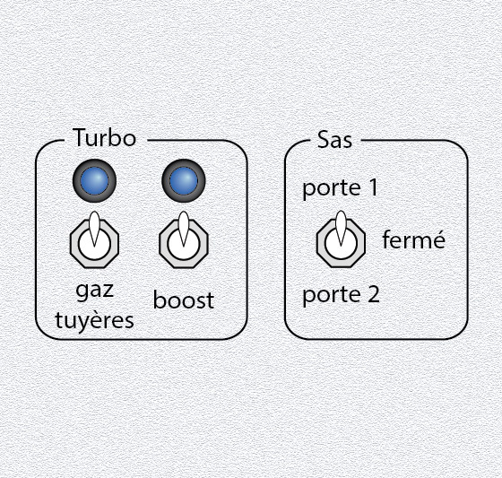

# Top 7) Buttons 1

This panel is composed of:
- two 2-position switches (`T7_SW2_1` and `T7_SW2_2`, aka `SW2_turbo_gas` and `SW2_turbo_boost`) and the associated LEDs (`T7_LED_1` and `T7_LED_2`, aka `LED_turbo_gas` and `LED_turbo_boost`).
- a 3-position switch for the gate (`T7_SW3` aka `T7_gates`), that can switch between open the gate 1, close the two gates and open the gate 2.

## Connections

| Element        | Function    | Connected to       |
|:--------------:|:-----------:|:------------------:|
| `T7_SW2_1`     | turbo gas   | TM#6, pin 7        |
| `T7_LED_1`     | turbo gas   | TM#5, led 0        |
| `T7_SW2_2`     | turbo boost | TM#6, pin 6        |
| `T7_LED_2`     | turbo boost | TM#5, led 7        |
| `T7_SW3`       | gates       | TM#5, pins 0 and 1 |

## Files
The [back](T7-back.pdf) and [label](T7-label.pdf) can be printed (100% scale, and vertical revert for the back).

## Photos
