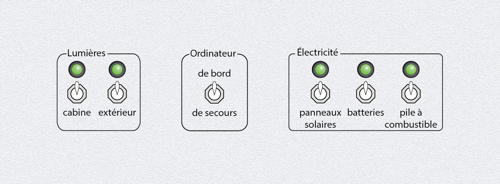

# Top 8) Buttons 2

This panel is composed of:
- two 2-position switches (`T8_SW2_1` and `T8_SW2_2`, aka `SW2_light_cabin` and `SW2_light_outside`) and the associated LEDs (`T8_LED_1` and `T8_LED_2`, aka `LED_light_cabin` and `LED_light_outside`) for the lights.
- three 2-position switches (`T8_SW2_3`, `T8_SW2_4` and `T8_SW2_5`, aka `SW2_solar`, `SW2_battery` and `SW2_fuel_cell`) and the associated LEDs (`T8_LED_3`, `T8_LED_4` and `T8_LED_5`, aka `LED_solar`, `LED_battery` and `LED_fuel_cell`) for the electricity sources.
- a 2-position switch for the gate (`T8_SW2_6` aka `SW2_computer`), that can switch between main and backup computer.

## Connections

| Element        | Function      | Connected to       |
|:--------------:|:-------------:|:------------------:|
| `T8_SW2_1`     | light cabin   | TM#6, pin 5        |
| `T8_LED_1`     | light cabin   | TM#5, led 2        |
| `T8_SW2_2`     | light outside | TM#6, pin 4        |
| `T8_LED_2`     | light outisde | TM#5, led 3        |
| `T8_SW2_3`     | solar         | TM#6, pin 2        |
| `T8_LED_3`     | solar         | TM#5, led 4        |
| `T8_SW2_4`     | battery       | TM#6, pin 1        |
| `T8_LED_4`     | battery       | TM#5, led 5        |
| `T8_SW2_5`     | fuel cell     | TM#6, pin 0        |
| `T8_LED_5`     | fuel cell     | TM#5, led 6        |
| `T8_SW2_6`     | gates         | TM#6, pin 3 |

## Files
The [back](T8-back.pdf) and [label](T8-label.pdf) can be printed (100% scale, and vertical revert for the back).

## Photos
