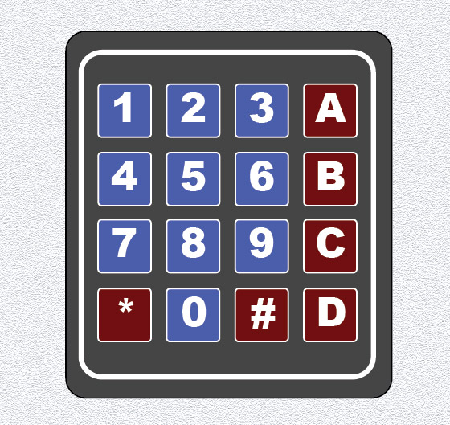

# Top 9) Keyboard

This panel is composed of:
- a 4x4 matrix keyboard

Due to limited inputs, only the 3 first columns (numbers `0` to `9`, `*` and `#`) are used.

## Connections
| Kb Pin | Function | Connected to   |
|:------:|:--------:|:--------------:|
|   1    | Line 1   |  TM , input    |
|   2    | Line 2   |  TM , input    |
|   3    | Line 3   |  TM , input    |
|   4    | Line 4   |  TM , input    |
|   5    | Column 1 |  TM , input    |
|   6    | Column 2 |  TM , input    |
|   7    | Column 3 |  TM , input    |
|   8    | Column 4 |  not connected |

## Files
The [back](T9-back.pdf) and [label](T9-label.pdf) can be printed (100% scale, and vertical revert for the back).

## Photos
